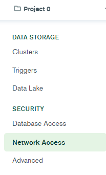

# Ресурсы необходимые для сборки проекта

### Сервер 
Установить библиотеки, необходимые для работы с Python:
1. BaseHTTPRequestHandler 
2. HTTPServer
3. pymongo

### Проект
Пройдя по [ссылке](https://stackoverflow.com/questions/53861300/how-do-you-properly-install-libcurl-for-use-in-visual-studio-2017), выполнить всю последовательность действий до 8 пункта.

### База данных 
1. Пройти по [ссылке](https://cloud.mongodb.com/) и зайти в аккаунт по данным (waid.one@yandex.ru:gR6HgfZdy).
2. Добавить свой IP-address.

